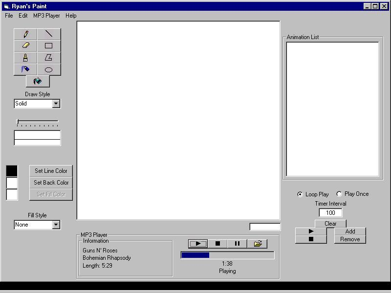



## Ryan's Paint

### Description

UPDATED AGAIN!!! I fixed it so that the progress bar isn't jumpy when trying to change position. It has a built in MP3 Player. Pretty COOL. Along with the MP3 Player update I also put in something when drawing an ellipse or rectangle it shows the height and width and when you draw a line it says the length of the line. I put on the fill regions code at last, but the fill styles didn't work so I got rid of them. There are cursors(I think you will have to move the cursors to C:\Program Files\Microsoft Visual Studio\VB98\ or it will be an arrow), and I also put in something that shows the frame number when you are playing the animation, and I made the animation list have numbers. Choose the style of animation. This paint program has the basics: rectangles, ellipses, paintbrush, freehand, spraypaint, eraser, lines, and connected lines. You can save and load pictures. There are also animations, and you can save and load those too. You can select the draw style and draw width also. You can also print your picture. It also lets you undo your last action. This program has it all!! Please comment on program and tell me what it needs. I hope you enjoy it and PLEASE rate the code.
 
### More Info
 

             |
---                |---
**Submitted On**   |2000-08-11 20:29:10
**By**             |[Ryan Chandler](https://github.com/Planet-Source-Code/PSCIndex/blob/master/ByAuthor/ryan-chandler.md)
**Level**          |Beginner
**User Rating**    |3.8 (15 globes from 4 users)
**Compatibility**  |VB 6\.0
**Category**       |[Complete Applications](https://github.com/Planet-Source-Code/PSCIndex/blob/master/ByCategory/complete-applications__1-27.md)
**World**          |[Visual Basic](https://github.com/Planet-Source-Code/PSCIndex/blob/master/ByWorld/visual-basic.md)
**Archive File**   |[CODE\_UPLOAD88788112000\.zip](https://github.com/Planet-Source-Code/ryan-chandler-ryan-s-paint__1-10475/archive/master.zip)

